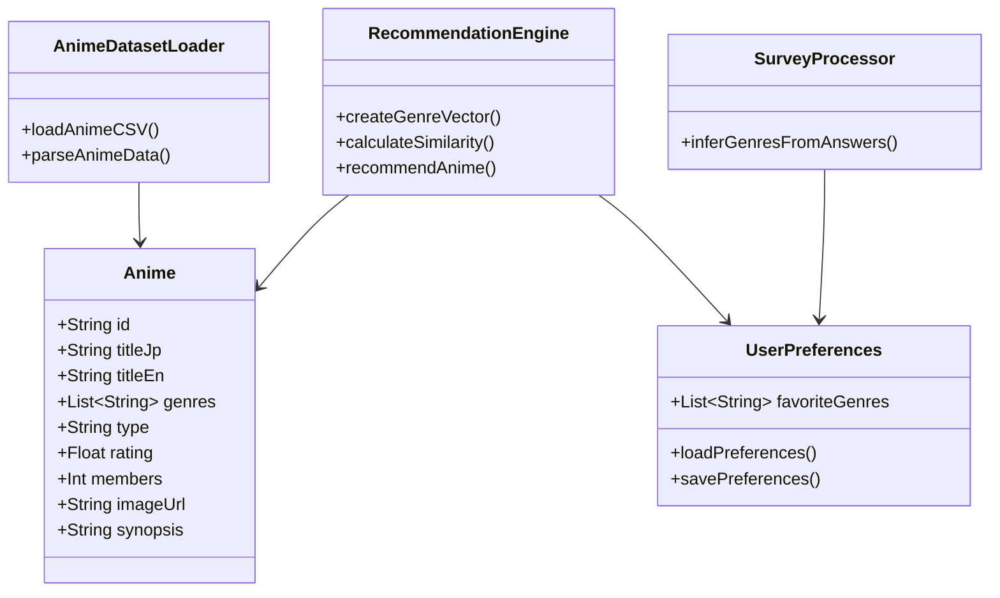

```mermaid
classDiagram
    class Anime {
      +String id
      +String titleJp
      +String titleEn
      +List~String~ genres
      +String type
      +Float rating
      +Int members
      +String imageUrl
      +String synopsis
    }

    class AnimeDatasetLoader {
      +loadAnimeCSV()
      +parseAnimeData()
    }

    class UserPreferences {
      +List~String~ favoriteGenres
      +loadPreferences()
      +savePreferences()
    }

    class RecommendationEngine {
      +createGenreVector()
      +calculateSimilarity()
      +recommendAnime()
    }

    class SurveyProcessor {
      +inferGenresFromAnswers()
    }

    AnimeDatasetLoader --> Anime
    RecommendationEngine --> Anime
    RecommendationEngine --> UserPreferences
    SurveyProcessor --> UserPreferences
```