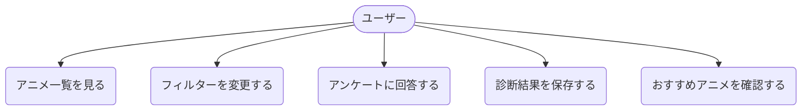
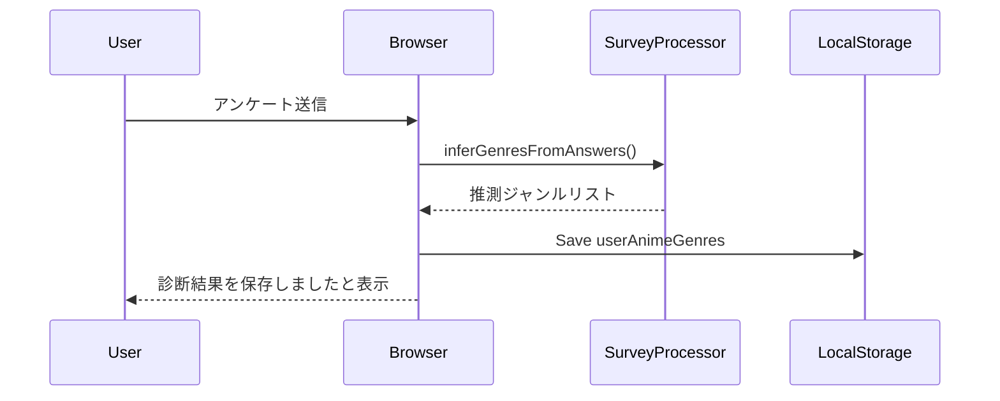
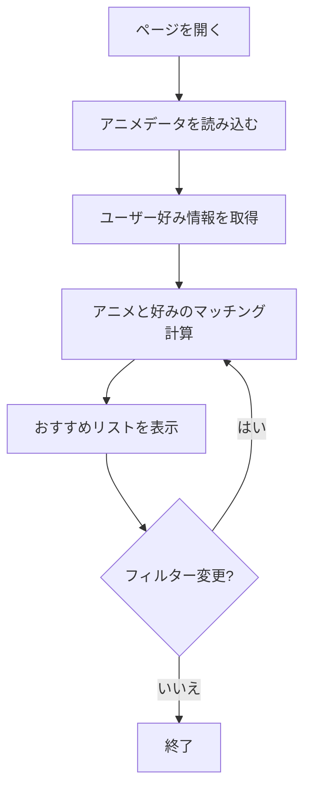
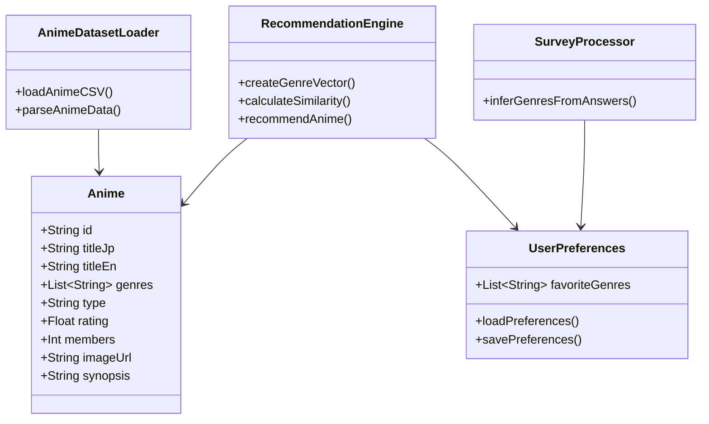
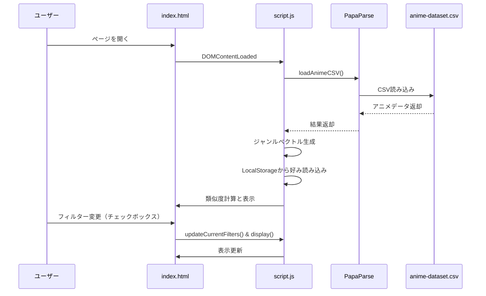

## ユースケース図

```mermaid
flowchart TD
    User([ユーザー]) --> A(アニメ一覧を見る)
    User --> B(フィルターを変更する)
    User --> C(アンケートに回答する)
    User --> D(診断結果を保存する)
    User --> E(おすすめアニメを確認する)
```

## シーケンス図

```mermaid
sequenceDiagram
    participant User
    participant Browser
    participant SurveyProcessor
    participant LocalStorage

    User->>Browser: アンケート送信
    Browser->>SurveyProcessor: inferGenresFromAnswers()
    SurveyProcessor-->>Browser: 推測ジャンルリスト
    Browser->>LocalStorage: Save userAnimeGenres
    Browser-->>User: 診断結果を保存しましたと表示
```

## アクティビティ図

```mermaid
flowchart TD
    A[ページを開く] --> B[アニメデータを読み込む]
    B --> C[ユーザー好み情報を取得]
    C --> D[アニメと好みのマッチング計算]
    D --> E[おすすめリストを表示]
    E --> F{フィルター変更?}
    F -- はい --> D
    F -- いいえ --> G[終了]
```

## クラス図

```mermaid
classDiagram
    class Anime {
      +String id
      +String titleJp
      +String titleEn
      +List~String~ genres
      +String type
      +Float rating
      +Int members
      +String imageUrl
      +String synopsis
    }

    class AnimeDatasetLoader {
      +loadAnimeCSV()
      +parseAnimeData()
    }

    class UserPreferences {
      +List~String~ favoriteGenres
      +loadPreferences()
      +savePreferences()
    }

    class RecommendationEngine {
      +createGenreVector()
      +calculateSimilarity()
      +recommendAnime()
    }

    class SurveyProcessor {
      +inferGenresFromAnswers()
    }

    AnimeDatasetLoader --> Anime
    RecommendationEngine --> Anime
    RecommendationEngine --> UserPreferences
    SurveyProcessor --> UserPreferences
```
## シーケンス図

```mermaid
sequenceDiagram
    participant U as ユーザー
    participant I as index.html
    participant S as script.js
    participant P as PapaParse
    participant CSV as anime-dataset.csv

    U->>I: ページを開く
    I->>S: DOMContentLoaded
    S->>P: loadAnimeCSV()
    P->>CSV: CSV読み込み
    CSV-->>P: アニメデータ返却
    P-->>S: 結果返却
    S->>S: ジャンルベクトル生成
    S->>S: LocalStorageから好み読み込み
    S->>I: 類似度計算と表示

    U->>I: フィルター変更（チェックボックス）
    I->>S: updateCurrentFilters() & display()
    S->>I: 表示更新
```