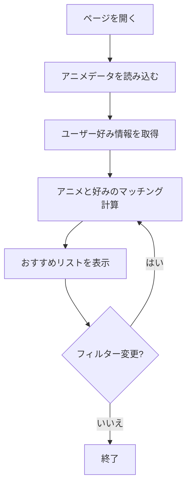

```mermaid
flowchart TD
    A[ページを開く] --> B[アニメデータを読み込む]
    B --> C[ユーザー好み情報を取得]
    C --> D[アニメと好みのマッチング計算]
    D --> E[おすすめリストを表示]
    E --> F{フィルター変更?}
    F -- はい --> D
    F -- いいえ --> G[終了]
```
