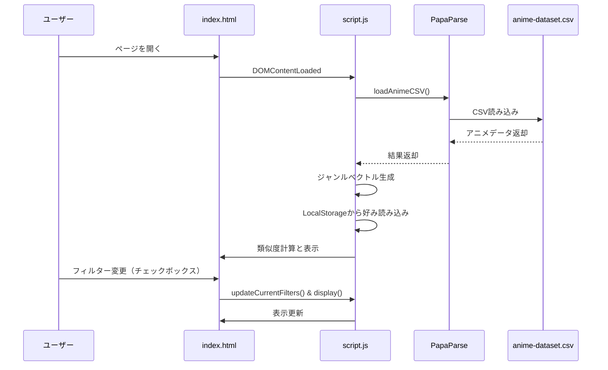
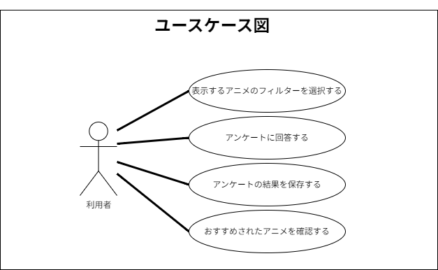

```mermaid
sequenceDiagram
    participant U as ユーザー
    participant I as index.html
    participant S as script.js
    participant P as PapaParse
    participant CSV as anime-dataset.csv

    U->>I: ページを開く
    I->>S: DOMContentLoaded
    S->>P: loadAnimeCSV()
    P->>CSV: CSV読み込み
    CSV-->>P: アニメデータ返却
    P-->>S: 結果返却
    S->>S: ジャンルベクトル生成
    S->>S: LocalStorageから好み読み込み
    S->>I: 類似度計算と表示

    U->>I: フィルター変更（チェックボックス）
    I->>S: updateCurrentFilters() & display()
    S->>I: 表示更新

```

